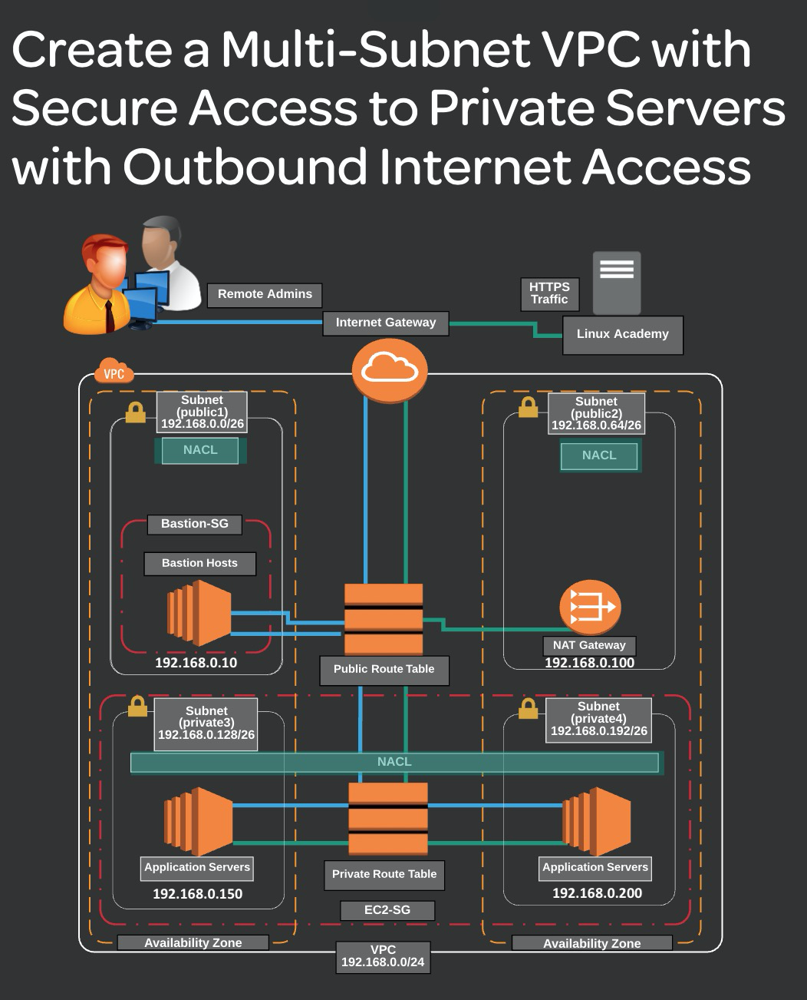

# ACG Lab 1 - Multi-Subnet VPC with Secure Access to Private Servers with Outbound Internet Access

## Setup

AWS configuration settings and credentials, using the AWS cli:
```
aws configure
```

Create SSH keys for the EC2 instances:
```
ssh-keygen -C "lab@example.com" -f key
```

## Terraform 
Terraform config file: 

- [`main.tf`](main.tf) file main set of configuration
- [`variables.tf`](variables.tf) file provides the values for the various CIDR ranges and IP adddresses.
- [`outputs.tf`](outputs.tf) file allows to output the public IP address of the Bastion Host

Initialize and apply the Terraform code:
```
terraform init

terraform apply -auto-approve
```

## Results

Ping the Bastion Host:
```
ping -c 5 $(terraform output -raw instance_public_ip)
```

Copy the SSH keys to the Bastion host:  
```
scp -i key -r key* ubuntu@<BASTION-Public-IP>:  
```

SSH into the Bastion host:  
```
ssh -i key ubuntu@$(terraform output -raw instance_public_ip)
```

From the Bastion host, SSH into one of the App servers:   
```
ssh -i key ubuntu@192.168.0.150  
ssh -i key ubuntu@192.168.0.200  
```

Once on one of the App servers, ping `google.com` to verify that traffic is correctly routed via the NAT gateway in the public2 subnet:
```
ping google.com  
```

---
## Tasks:
- Create the VPC skeleton
    - Create a VPC with four subnets.
- Create the Internet Gateway, then a public and a private route table
    - Create an Internet Gateway and attach it to the VPC. 
    - Create a public route table with a default route to the internet gateway and create a private route table.
- Configure the bastion host
    - Create the NACLs and Security Group configuration for the bastion host.
    - Set up the bastion host Amazon EC2 instance and verify connectivity using SSH.
- Create an Amazon EC2 instance in the private subnet
    - Create the NACLs and Security Group configuration necessary to support SSH connectivity between the bastion host and an Amazon EC2 instance in the private subnet.
    - Create an instance in the private subnet and verify SSH connectivity from the bastion host.
- Set up the NAT Gateway and validate connectivity
    - Create the NACLs required for the NAT Gateway Subnet.
    - Create the NAT Gateway, and set it as the target for the default route in the private route table.
    - Verify connectivity to the Internet from the private EC2 instance.




